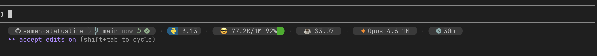

# sameh-statusline

A powerline-style status bar for [Claude Code](https://docs.anthropic.com/en/docs/claude-code) that displays rich project context at a glance — git state, tech stacks, dev tools, context window usage, session cost, and more.



## Features

| Segment | What it shows |
|---------|---------------|
| **Project** | Git host icon (GitHub/GitLab/Azure/Bitbucket), repo name |
| **Branch** | Current branch, commit age, sync status (ahead/behind/synced) |
| **Git Health** | Dirty/clean indicator, staged/modified/untracked counts, insertions/deletions |
| **Stash** | Stash count when stashes exist |
| **Worktree** | Worktree indicator when working in a git worktree |
| **PR Status** | PR state via `gh` CLI — draft, open, approved, changes requested, merged |
| **Stacks** | Auto-detected language/framework with version — Python, Node, TypeScript, React, Next.js, Vue, Angular, Svelte, Go, Rust, Ruby |
| **Dev Tools** | Auto-detected tooling — Docker, Kubernetes, AWS, Terraform, Vercel, GitHub CI, and more |
| **Context Window** | Visual progress-fill bar with gradient (green to red), token count, remaining %, mood emoji |
| **Cost** | Session spending with journey emoji (free -> coffee -> pizza -> ... -> skull) |
| **Model** | Current model name with randomized vibrant icon color |
| **Session Duration** | How long the session has been running |
| **Vim Mode** | Current vim mode when vim keybindings are active |
| **CWD** | Relative path when the agent navigates away from the project root |

### Design

- **Rounded pill badges** with powerline half-circle caps
- **Brand-colored stack badges** (Python blue, React teal, Rust orange, etc.)
- **Muted 256-color palette** suited for dimmed terminal displays
- **Progressive truncation** — segments drop gracefully as the terminal narrows
- **File-based caching** — stacks, tools, and PR status are cached to keep renders fast (30s TTL)

## Requirements

### Python 3.10+

Uses stdlib only — zero external dependencies. Comes pre-installed on macOS and most Linux distributions.

### Nerd Font (required)

This statusline uses [Nerd Font](https://www.nerdfonts.com/) glyphs extensively for icons — branch symbols, language logos, git indicators, powerline separators, and more. **Without a Nerd Font, the status bar will show missing-glyph squares instead of icons.**

Install any Nerd Font patched variant and set it as your terminal font:

| Font | Install |
|------|---------|
| [Hack Nerd Font](https://github.com/ryanoasis/nerd-fonts/tree/master/patched-fonts/Hack) | `brew install font-hack-nerd-font` |
| [FiraCode Nerd Font](https://github.com/ryanoasis/nerd-fonts/tree/master/patched-fonts/FiraCode) | `brew install font-fira-code-nerd-font` |
| [JetBrains Mono Nerd Font](https://github.com/ryanoasis/nerd-fonts/tree/master/patched-fonts/JetBrainsMono) | `brew install font-jetbrains-mono-nerd-font` |

> **Tip:** On macOS, tap the cask first: `brew tap homebrew/cask-fonts` (may not be needed on newer Homebrew versions). On Linux, download from [nerdfonts.com/font-downloads](https://www.nerdfonts.com/font-downloads) and install to `~/.local/share/fonts/`. Then select the Nerd Font variant in your terminal emulator's font settings.

To verify your font has Nerd Font glyphs, run:

```bash
echo -e "\ue0b6 \ue0b4 \ue0b0 \ue0a0 \uf07c \ue606 \ue718"
```

You should see: rounded half-circles, a triangle, a branch symbol, a folder, a Python logo, and a Node.js logo. If you see boxes or question marks, your terminal is not using a Nerd Font.

### Git

The **Project**, **Branch**, **Git Health**, **Stash**, **Worktree**, and **PR** segments all read git state via `git`. Without git installed — or when the working directory isn't a git repository — those segments are simply omitted and the rest of the bar still renders. Comes pre-installed on macOS and most Linux distributions.

### 256-color terminal

Colors use the 256-color palette (not truecolor), so a 256-color-capable terminal is expected. Any modern terminal emulator qualifies.

### `gh` CLI (optional)

Enables PR status detection (draft, open, approved, changes requested, merged). Install with `brew install gh` and authenticate with `gh auth login`.

## Installation

### Quick Install (recommended)

```bash
curl -fsSL https://raw.githubusercontent.com/samehkamaleldin/sameh-statusline/main/install.sh | bash
```

This downloads `statusline.py` to `~/.claude/` and configures `settings.json` automatically.

### pip Install

```bash
pip install sameh-statusline
```

Then add to your `~/.claude/settings.json`:

```json
{
  "statusLine": {
    "type": "command",
    "command": "sameh-statusline"
  }
}
```

### Manual Install

1. Download the script:

```bash
curl -fsSL https://raw.githubusercontent.com/samehkamaleldin/sameh-statusline/main/statusline.py \
  -o ~/.claude/statusline.py
chmod +x ~/.claude/statusline.py
```

2. Add to `~/.claude/settings.json`:

```json
{
  "statusLine": {
    "type": "command",
    "command": "python3 ~/.claude/statusline.py"
  }
}
```

3. Restart Claude Code.

### Let Claude Code Install It For You

Copy the prompt from [PROMPT.md](PROMPT.md) and paste it into Claude Code — it will clone, install, and configure everything for you.

## How It Works

Claude Code pipes a JSON object to the statusline command on every render. The JSON includes workspace info, context window state, cost data, and model info.

The statusline script:

1. **Parses** the stdin JSON for workspace, context, cost, and model data
2. **Detects** git state via `git status --porcelain=v2` and related commands
3. **Detects** tech stacks by scanning for marker files (`package.json`, `pyproject.toml`, `Cargo.toml`, etc.)
4. **Detects** dev tools by checking for config files and CLI availability
5. **Caches** slow-changing data (stacks, tools, PR status) to `~/.cache/claude-statusline/`
6. **Renders** ANSI-escaped powerline segments with 256-color styling
7. **Truncates** progressively if the output exceeds terminal width

### Stdin JSON Schema

Claude Code provides this JSON on stdin:

```json
{
  "workspace": {
    "project_dir": "/path/to/project",
    "current_dir": "/path/to/current"
  },
  "context_window": {
    "context_window_size": 200000,
    "used_percentage": 25.0,
    "remaining_percentage": 75.0,
    "current_usage": {
      "input_tokens": 50000,
      "cache_creation_input_tokens": 0,
      "cache_read_input_tokens": 0
    }
  },
  "cost": {
    "total_cost_usd": 1.50,
    "total_duration_ms": 120000
  },
  "model": {
    "display_name": "Opus 4.6 (1M context)"
  },
  "vim": {
    "mode": "NORMAL"
  }
}
```

## Segment Reference

### Context Window

The context pill is a visual progress bar — the text IS the bar. As context fills up:

| Usage | Color | Mood |
|-------|-------|------|
| 0-15% | Dark green | `😎` |
| 15-25% | Medium green | `🤓` |
| 25-35% | Bright green | `😊` |
| 35-45% | Yellow-green | `🙂` |
| 45-55% | Yellow | `😐` |
| 55-65% | Amber | `😟` |
| 65-75% | Orange | `😰` |
| 75-85% | Deep orange | `😱` |
| 85-92% | Bright red | `🤯` |
| 92%+ | Dark red | `☢️` |

### Cost Journey

The cost emoji tells a story as your session spending grows:

| Range | Emoji | Meaning |
|-------|-------|---------|
| $0 | `🆓` | Free |
| $0.50 | `🫧` | Bubble |
| $1 | `🪙` | A coin |
| $2 | `💵` | A bill |
| $3-5 | `☕` `🍩` | Coffee & donuts |
| $5-10 | `🌯` `🍕` | Lunch |
| $10-20 | `🍱` `🎫` `📚` | Bento, tickets, books |
| $20-50 | `👕` `🎮` `👟` `💇` `🛒` | Shopping |
| $50-100 | `⛽` `💊` `🎭` `🧳` | Gas, meds, shows |
| $100-200 | `💳` `📱` `🎸` `🎿` `✈️` `🏨` | Big purchases |
| $200-300 | `🔥` `😰` `🚗` `💸` | Getting serious |
| $300-400 | `🤑` `😱` `🏦` `🚨` | Panic territory |
| $400+ | `📉` `🆘` `💀` `☠️` `🪦` `☢️` `🌋` `💥` | RIP |

### Git Hosts

The project pill shows different icons based on the git remote host:

| Host | Description |
|------|-------------|
| GitHub | GitHub logo (Nerd Font `nf-md-github`) |
| GitLab | GitLab logo (Nerd Font `nf-md-gitlab`) |
| Azure DevOps | Azure logo (Nerd Font `nf-md-microsoft_azure`) |
| Bitbucket | Bitbucket logo (Nerd Font `nf-dev-bitbucket`) |
| Local (no remote) | Git logo (no remote tracking) |

### Stack Badges

Languages and frameworks are auto-detected from project marker files and displayed as brand-colored pill badges:

| Stack | Detected by | Badge Style |
|-------|-------------|-------------|
| Python | `pyproject.toml`, `requirements.txt`, `setup.py`, `uv.lock` | Yellow icon on CPython blue |
| Next.js | `"next"` in `package.json` | White icon on near-black |
| React | `"react"` in `package.json` | Cyan icon on dark teal |
| TypeScript | `tsconfig.json` present | White icon on TS blue |
| Node.js | `package.json` (fallback) | Sky blue icon on dark green |
| Vue | `"vue"` in `package.json` | Green icon on dark green |
| Angular | `"@angular/core"` in `package.json` | Red icon on dark red |
| Svelte | `"svelte"` in `package.json` | Orange icon on dark red |
| Go | `go.mod` | Cyan icon on dark teal |
| Rust | `Cargo.toml` | Orange icon on dark brown |
| Ruby | `Gemfile` | Red icon on dark red |

### Dev Tools

Auto-detected from project config files, docker-compose, `.env` files, and CLI availability:

| Tool | Detected by |
|------|-------------|
| Docker | `Dockerfile`, `docker-compose.yml`, `.dockerignore` |
| Kubernetes | `k8s/`, `kustomization.yaml` |
| Helm | `Chart.yaml` |
| AWS | `samconfig.toml`, `.aws/`, `cdk.json`, `aws` CLI |
| Azure | `.azure/`, `azure-pipelines.yml` |
| GCP | `app.yaml`, `.gcloud/` |
| Vercel | `vercel.json`, `.vercel/` |
| Terraform | `.terraform/`, `*.tf` files |
| Ansible | `ansible.cfg`, `playbook.yml` |
| GitHub CI | `.github/workflows/` |
| GitLab CI | `.gitlab-ci.yml` |
| DVC | `.dvc/`, `dvc.yaml` |
| PostgreSQL | `postgres`/`postgresql` in `.env` or docker-compose |
| Redis | `redis` in `.env` or docker-compose |
| MongoDB | `mongo`/`mongodb` in `.env` or docker-compose |
| pnpm / yarn / npm | Respective lock files |
| uv / poetry | `uv.lock` / `poetry.lock` |
| Nginx | `nginx.conf`, `nginx/` |
| Supabase | `supabase/` |
| Firebase | `firebase.json`, `.firebaserc` |

## Configuration

The statusline is configured via Claude Code's `settings.json` at `~/.claude/settings.json`:

```json
{
  "statusLine": {
    "type": "command",
    "command": "python3 ~/.claude/statusline.py"
  }
}
```

The `type: "command"` setting tells Claude Code to pipe its JSON state to the command's stdin and display the stdout as the status line.

## Contributing

Contributions welcome! The entire statusline is a single Python file (`statusline.py`) with zero external dependencies. Keep it that way.

1. Fork the repo
2. Make your changes to `statusline.py`
3. Test with: `echo '{"workspace":{"project_dir":"'$(pwd)'"},"context_window":{"context_window_size":200000,"used_percentage":30,"remaining_percentage":70},"cost":{"total_cost_usd":2.5,"total_duration_ms":300000},"model":{"display_name":"Opus 4.6"}}' | python3 statusline.py`
4. Open a PR

## License

[MIT](LICENSE)
