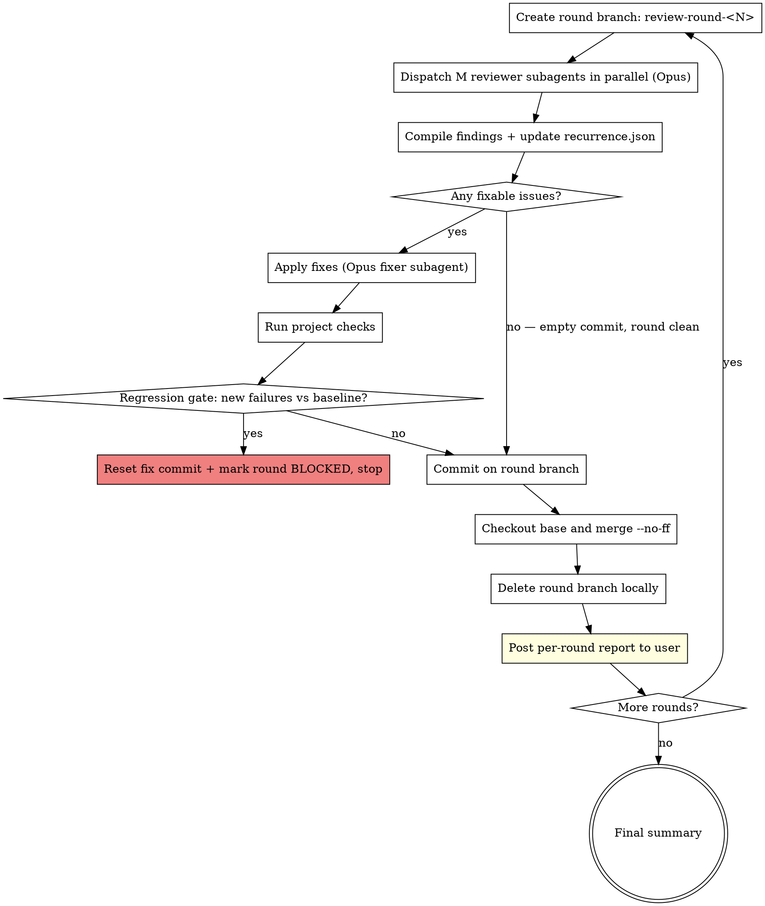

# Review Rounds

Iteratively harden recent changes by running multiple rounds of parallel reviews, compiling issues, fixing them, and merging each round back to main. Each round is one cycle of **Review → Compile → Fix → Commit → Merge**.

The default target is **recent work on this branch** — uncommitted changes plus the last few commits — and the default lens is a bluntly critical audit for **slop, over-engineering, complexity, duplication, security, and performance**. This skill exists to clean up the kind of low-quality accretion that builds up during feature work.

## When to Use

- User says `/review-rounds` (with or without arguments)
- User asks for "N rounds of review", "multi-round review", "iterative review"
- User wants a cleanup pass over recent work before wrapping a feature
- User wants multiple independent reviewer perspectives, consolidated and fixed

## Defaults

| Parameter     | Default                                   | Meaning                                                   |
|---------------|-------------------------------------------|-----------------------------------------------------------|
| `subagents`   | 3                                         | Parallel reviewer subagents per round                     |
| `rounds`      | 5                                         | Total rounds to run                                       |
| `model`       | `opus`                                    | All reviewer + fixer subagents use Opus                   |
| `scope`       | recent changes (see below)                | What the reviewers look at                                |
| `base`        | `main`                                    | Branch to branch from and merge each round into           |
| `focus`       | slop, over-engineering, complexity, dedup, security, performance | Review lenses used by default |
| `commits`     | 10                                        | How many recent commits on the current branch to include  |

Override via natural args: `/review-rounds subagents=4 rounds=3 scope="apps/web/src/features/admin" commits=20`.

### Default scope resolution

When the user does not specify a scope, resolve it as:

1. **Uncommitted changes** (tracked, staged, and unstaged) via `git diff --name-only HEAD` + `git ls-files --others --exclude-standard` for untracked files.
2. **Recent commits on the current branch.** Prefer `git log --name-only --pretty=format: <base>..HEAD` (commits ahead of `base`) when on a feature branch. If on `base` itself, or if `<base>..HEAD` is empty, fall back to the last `commits` commits: `git log -n <commits> --name-only --pretty=format: HEAD`.
3. Union and deduplicate the file list. Drop files that no longer exist.
4. If the resulting list is empty, tell the user and stop — there's nothing to review.

Reviewers get both the file list and a short summary of the recent commits (`git log --oneline -n <commits>`) so they understand what changed and why.

Auto mode runs without prompting between rounds. **All reviewers and fixers run as subagents** — never inline by the controller — unless the user explicitly opts out at invocation time (e.g. `subagents=off`). After each round merges, post a **per-round report** (findings, fixes applied, fixes skipped, regression-gate result, recurrence flags) so the user can follow along. Reports are write-and-continue; they are not pauses. Only stop if preflight fails or a blocker hits mid-run.

## Preflight Checks

Before Round 1:

1. **Resolve scope.** Build the default change set (or use the user's explicit scope). If empty, abort with a clear message.
2. **Base branch sanity.** Confirm `base` exists. Do not auto-pull or auto-switch base. If the user is already on `base`, that's fine — rounds still branch off it.
3. **Dirty tree handling.** If there are uncommitted changes AND they are part of the review scope (the default case), that's fine — Step 1 stashes them onto the round branch. If they are NOT in scope (user gave an explicit unrelated scope), abort and tell the user to commit/stash first.
4. **Announce plan.** One short paragraph: `N` rounds × `M` reviewers, resolved scope (file count + "last K commits + uncommitted"), focus lenses, base branch.
5. **Capture baseline checks.** Detect the project's check commands (see Step 4 detection list) and run them once. Record pass/fail and the set of currently-failing tests/errors as `baseline` in `.review-rounds/state.json`. This is the reference the **regression gate** (Step 4) uses to distinguish *new* failures (fixer's fault) from pre-existing ones. If checks were already red, that's fine — it's the baseline; do NOT abort. If no check command exists, record `baseline: none` and skip the regression gate later.
6. **Tag pre-run snapshot.** `git tag review-rounds/start-<epoch>` on the current `<base>` tip so subsequent rounds and the final summary can diff against a stable starting point. Tag is local-only; never pushed. Store the tag name in `.review-rounds/state.json` as `start_ref`.

## Per-Round Flow



### Step 1 — Create round branch

```bash
# Round 1 only: if uncommitted changes are in the review scope,
# stash them so they come with us to the round branch.
git stash push -u -m "review-rounds: carry uncommitted to round 1"  # only if dirty

git checkout <base>
git checkout -b review-round-<N>

# Round 1 only: reapply stash, then commit as "pre-round snapshot" so
# the round's actual fix commit(s) can layer cleanly on top.
git stash pop  # only if stashed above
git add -A
git commit -m "review-rounds: snapshot uncommitted changes before round 1"  # only if anything was stashed
```

`<N>` is the 1-indexed round number. If `review-round-<N>` already exists from a prior run, append a timestamp (`review-round-<N>-<epoch>`).

For rounds 2..N, the base already contains prior-round merges, so no stash handling is needed — just `git checkout <base> && git checkout -b review-round-<N>`.

### Step 2 — Dispatch reviewer subagents in parallel

**Dispatch all M reviewers in a single message with multiple `Agent` tool calls.** Every reviewer gets:

- `subagent_type`: `general-purpose`
- `model`: `"opus"` — always
- Identical scope brief but a **distinct lens** so findings don't fully overlap

**Default lens rotation** (pick M; with M=3, use the first three; reuse across rounds is fine):

| Lens | Focus |
|------|-------|
| **slop** | Dead code, commented-out blocks, half-finished TODOs, stale comments, accidental debug logs, placeholder strings, unused imports/exports, unreachable branches. Anything that shouldn't have landed. |
| **over-engineering** | Premature abstractions, unused flexibility, one-caller "helpers", speculative generics, interfaces with one implementation, config surfaces nothing sets, backwards-compat shims for no one. YAGNI violations. |
| **complexity** | Functions doing too much, deep nesting, unclear control flow, state machines that could be straight-line, clever code where obvious code would do, cognitive-load spikes. Readability regressions. |
| **duplication** | Copy-pasted blocks, near-identical branches, parallel code paths that should be one, re-implementations of existing utilities, drift between similar modules. Missed DRY opportunities worth consolidating (but NOT flagging "similar-looking" code that's genuinely independent). |
| **security** | Injection (SQL/command/XSS), auth bypass, authz gaps, secret leakage, unsafe deserialization, path traversal, SSRF, prototype pollution, unsafe regex, missing input validation at trust boundaries, logged secrets. OWASP Top 10. |
| **performance** | N+1 queries, needless re-renders, unbounded loops/retries, sync work on hot paths, memory leaks, oversized payloads, missing memoization where it matters, accidental O(n²). Real perf issues, not micro-optimizations. |

Additional lenses (use if the user specifies `focus=` explicitly, or if M > 6):

| Lens | Focus |
|------|-------|
| **correctness** | Logic bugs, null/undefined, off-by-one, race conditions, wrong assumptions |
| **types/api** | Type holes, unsafe casts, leaky abstractions, public API ergonomics |
| **tests** | Coverage gaps, weak assertions, missing edge cases, flakiness risk |
| **architecture** | Boundaries, coupling, responsibility violations |
| **ux/frontend** | Accessibility, keyboard nav, loading/error states, layout regressions |

Each reviewer returns findings in this exact format (tell them explicitly):

```markdown
## Findings

| # | Severity | File:Line | Issue | Suggested Fix |
|---|----------|-----------|-------|---------------|
| 1 | HIGH | path/to/file.ts:42 | ... | ... |

## Summary
<1-3 sentences>
```

Severity scale: `CRITICAL | HIGH | MEDIUM | LOW | NIT`.

Reviewer prompt template (fill in and pass to each Agent invocation):

```
You are reviewer <K>/<M> in round <N>/<TOTAL_ROUNDS> of an iterative review.

Working directory: <cwd>
Round branch: review-round-<N> (already checked out — you are on it now)
Base branch: <base>

**Your lens: <LENS_NAME>** — focus disproportionately here. Other reviewers in
this round cover other lenses; you are not the only pass. Do not try to cover
everything.

Lens brief: <LENS_FOCUS_DESCRIPTION>

Scope — recent changes only:
- Files in scope (read these, plus any adjacent files you need for context):
<FILE_LIST>

- Recent commits (context for why this code exists):
<git log --oneline output, up to `commits`>

- Unified diff of the cumulative review-rounds state (the canonical "what changed"
  — this includes the original feature work AND any fix commits from prior rounds):
<git diff review-rounds/start-<epoch>..HEAD>

Recurring issues from prior rounds (round 2+ only — empty in round 1):
<For each entry in .review-rounds/recurrence.json with rounds.length >= 1 and not
 yet marked resolved: list file:line, lens, severity, and a one-line description.
 Tell the reviewer: "These were flagged in earlier rounds and supposedly fixed.
 Verify each is actually fixed in the current code. If still present, flag again
 with severity bumped one level — a recurrence is worse than a first sighting.">

Ground rules:
- Report ONLY material issues grounded in code you actually read through your lens.
- Do NOT report taste/style preferences. Do NOT speculate about files you didn't open.
- Be blunt. The user explicitly wants slop, over-engineering, and accidental
  complexity flagged. Don't soften findings to be polite.
- If an issue is near an old line (not in the diff) but the recent changes made
  it worse or exposed it, still flag it — but note that it's pre-existing.
- If the diff is clean through your lens, say so in 1 sentence and return an
  empty findings table. Do not invent problems to justify the review.

Return findings in the exact markdown table format below. Under 500 words total.

## Findings

| # | Severity | File:Line | Issue | Suggested Fix |
|---|----------|-----------|-------|---------------|

## Summary
<1-3 sentences>
```

### Step 3 — Compile the fix todo list

Once all M reviewers return, you (the controller) build a single unified list:

1. Parse every reviewer's table into rows.
2. **Deduplicate** — same `File:Line + Issue` within one severity level is one entry. Record which reviewers found it (higher confidence = higher priority).
3. **Rank** by severity (CRITICAL → HIGH → MEDIUM → LOW → NIT), then by cross-reviewer agreement.
4. **Drop NITs** unless the round number is ≥ 4. Early rounds focus on material issues. Also drop any finding that is purely a taste/style preference even if labeled higher — the reviewer was told not to, but reviewers sometimes slip.
5. **Prefer deletion-shaped fixes.** When the same issue can be resolved by removing code or by adding code, take the removal path in the todo description.
6. Write the list to `.review-rounds/round-<N>-todos.md` (create the dir if missing) so the fix phase has a stable reference. This file is NOT committed — add `.review-rounds/` to `.git/info/exclude` if the repo lacks a broad gitignore.
7. **Update `.review-rounds/recurrence.json`.** For each finding, compute a stable key `<file>:<approximate-line>:<sha1(issue-summary)[:8]>`. If the key already exists, append the current round number to its `rounds` array and bump its priority for the fixer (recurrences are real). If new, add it with `{ rounds: [N], lens, severity, file, line, issue, status: "open" }`. After Step 6 (merge), entries that were in the round's todo list and got fixed are marked `status: "fixed-round-<N>"` — but they stay in the file so round N+1 reviewers can verify they're actually gone.

Todo format:
```markdown
# Round <N> Fix List
Total: <count> | CRITICAL: <n> HIGH: <n> MEDIUM: <n> LOW: <n>

## 1. [HIGH] path/to/file.ts:42 — <short title>
**Found by:** reviewer-correctness, reviewer-types
**Issue:** <issue>
**Fix:** <suggested fix>

## 2. ...
```

If total actionable issues = 0, **skip Step 4** and proceed to Step 5 with a commit message noting the round was clean.

### Step 4 — Apply fixes

**Always dispatch an Opus fixer subagent** — never fix inline from the controller. Subagents keep the controller's context lean and the trail visible. The only exception is if the user explicitly disabled subagents at invocation (`subagents=off`); in that case fix inline. Reviewers are subagents under the same rule.

The fixer gets the full todo list and scope. It works top-down, runs project checks after each logical batch, and reports back what it fixed vs. skipped (with reasons).

Fixer prompt template:

```
You are the fixer for round <N>. Work through the fix todo list at .review-rounds/round-<N>-todos.md.

Scope: <scope — recent changes only, same file list the reviewers got>
Rules:
- Prefer deletion over addition. Most items in this list are slop, over-engineering,
  or complexity — the fix is usually to REMOVE code, not add more. If a suggested
  fix adds abstraction, question it.
- Do NOT introduce unrelated changes. Stay inside the scope. Fix only what's listed.
- If a todo is wrong, misleading, or not a real issue, skip it and note why in your
  report. Don't force broken fixes.
- For genuine bugs with existing test coverage, keep tests green. For bugs in
  untested code, add a minimal failing test first, then the fix.
- Do NOT add new tests just to chase coverage. Only add a test when it directly
  pins a bug you're fixing.
- After every ~5 fixes and at the end, run: <project-specific check commands>
- Report: fixed count, skipped count (with reasons per skip), any blockers.
```

Pass `model: "opus"`. Check commands to supply:
- TypeScript project: `bun run typecheck` or `pnpm typecheck` (inspect `package.json`)
- With tests: `bun test` or `pnpm test`
- Rust: `cargo check && cargo test`
- Python: `pytest` + `mypy` / `ruff`

If the project has no obvious check command, skip that line in the prompt and record `baseline: none` in state so the regression gate is skipped too.

### Step 4b — Regression gate (only if baseline checks exist)

After the fixer subagent returns, run the same check commands used for the baseline. Compare against `baseline` in `.review-rounds/state.json`:

- **Pass** = no test/check that was passing in baseline is now failing, and no new typecheck/lint errors that weren't there before. Pre-existing failures staying red is fine — that's the baseline.
- **Fail** = any new failure that didn't exist in baseline.

On failure:

```bash
# Discard the fixer's changes on the round branch — they regressed something.
git reset --hard HEAD            # if fixer hadn't committed yet
# OR (if fixer subagent already committed inside its run):
git reset --hard HEAD~1
```

Then stop the entire review-rounds run with a clear report: which round, which checks newly failed, what the fixer claimed it changed, and a pointer to the fixer's todo file. Do NOT merge a regressing round into base. Do NOT continue to round N+1. The user investigates and re-runs.

Record the regression in `.review-rounds/state.json` under `rounds.<N>.regression` so the final summary (if the user re-runs and completes) reflects it.

### Step 5 — Commit on round branch

**Every round produces a commit.** Even a clean round (zero findings) gets an empty commit so the cadence is preserved in history. Never skip this step.

```bash
git add -A  # scoped to the actual fix paths when possible — prefer specific adds
git commit -m "$(cat <<'EOF'
review-round-<N>: <short summary>

- <count> issues fixed (<crit>/<high>/<med>/<low>)
- <optional: skipped items and why>
EOF
)"
```

If the round was clean (zero issues), create an **empty commit** so the round shows up in history:

```bash
git commit --allow-empty -m "review-round-<N>: clean — no actionable findings"
```

### Step 6 — Merge to base, no PR

```bash
git checkout <base>
git merge --no-ff review-round-<N> -m "Merge review-round-<N>"
git branch -d review-round-<N>
```

Never `--force` anything. Never push. If the user wants it pushed, they'll say so.

### Step 6b — Per-round report (always)

Immediately after the merge, post a concise report to the user. Write it as a single message in this shape — do NOT pause for input, proceed to the next round as soon as it's posted:

```markdown
### Round <N>/<TOTAL> — <clean | fixed | blocked>

**Reviewers:** <M> × <lens list for this round>
**Findings:** <total>  (CRIT <n> / HIGH <n> / MED <n> / LOW <n> / NIT <n>)
**Fixed:** <count>     **Skipped:** <count>  **Recurrences:** <count from prior rounds re-flagged>
**Regression gate:** pass | skipped (no baseline) | FAIL — <one-line reason>
**Round commit:** <sha>   **Merge commit on <base>:** <sha>

**Top issues fixed this round:**
- [HIGH] path/file.ts:42 — <one-line summary>
- [HIGH] path/other.ts:88 — <one-line summary>
- [MED]  ...

**Skipped (with reasons):**
- path/file.ts:120 — <why skipped, e.g. "not a real issue", "out of scope", "intentional">

**Next:** proceeding to round <N+1> | stopping (regression / clean × 2 / final round).
```

This is the user's heartbeat for the run. Keep it tight — under ~30 lines per round. Truncate long lists with `...and K more` rather than dumping everything.

### Step 7 — Loop or finish

Continue to round N+1 unless:

- The configured round count is reached, OR
- Two consecutive rounds have found zero actionable issues (early-terminate with a note — tell the user and stop)

## Final Summary

After the last round:

```markdown
## Review Rounds Complete

**Scope:** <scope>
**Rounds run:** <N>/<TOTAL>  (early-terminated? yes/no)
**Total issues found:** <sum across rounds>
**Total issues fixed:** <sum>
**Total issues skipped (with reason):** <sum>

### Per-round breakdown
| Round | Findings | Fixed | Skipped | Commit |
|-------|----------|-------|---------|--------|
| 1 | ... | ... | ... | <sha> |
| ... |

### Remaining concerns
<anything reviewers flagged repeatedly but that was judged out of scope or non-actionable>
```

## Auto Mode Rules

Auto mode means **do not stop to ask the user between rounds or between steps within a round.** Plow through. Per-round reports (Step 6b) are write-and-continue — post the report, immediately start the next round. Do not wait for acknowledgement.

Only stop for:

- Preflight failure (dirty tree, missing scope, etc.)
- A fix subagent reports `BLOCKED` with no viable path
- A merge conflict (shouldn't happen since rounds run serially, but if it does, stop)
- **Regression gate failure** (new check failures vs baseline) — reset and stop, never merge
- Two consecutive clean rounds (early-terminate, this is success, not a blocker)

When stopping for any of the above, report clearly: which round, which step, what went wrong, and what the user can do.

## Important Guardrails

- **Never push.** `git push` is not part of this skill. The user merges manually or pushes separately.
- **Never open PRs.** This skill explicitly skips PRs — merges are direct via `--no-ff`.
- **Never rebase or force-push.** Even if a round's commit looks redundant, keep it.
- **Never skip the merge.** Each round ends with a merge, even if clean (empty commit preserves the cadence).
- **Always Opus for every subagent.** Pass `model: "opus"` on every `Agent` invocation in this skill.
- **Always subagents.** Reviewers AND fixers run as subagents — never inline by the controller. Only exception: explicit user opt-out (`subagents=off`).
- **Always commit, always merge, every round.** Clean round → empty commit + merge. Regressing round → reset and stop, do NOT merge. No round produces a silent no-op.
- **Always report after merge.** Step 6b runs every round, before looping. The user's only feedback channel during an auto run is these reports.
- **Reviewers get no memory of prior rounds** *except* the explicit `recurrence.json` injection (Step 2). Don't paste prior reviewer findings into their prompt — only the recurrence keys with file/line/lens. Independence on everything else is the point.
- **The controller (you) keeps round-over-round context** via `.review-rounds/state.json` and `recurrence.json`. Track recurring issues — if the same key appears in rounds 2 and 3 despite being "fixed" in round 2, the fix was wrong; surface this in the round report and bump severity for the next fixer pass.

## Red Flags

| Thought | Reality |
|---------|---------|
| "I'll skip the branch and just do it on main" | No. Round isolation is the point. |
| "Three reviewers are redundant, one is enough" | No — independence catches things a single pass misses. |
| "Let me ask the user whether to continue" | Auto mode means don't ask. Only stop on actual blockers. |
| "The fixer can batch across rounds" | No — one fix batch per round, committed per round. |
| "I'll push since I'm done anyway" | No. Pushing is never in scope for this skill. |
| "The round was clean, skip the merge" | No. Empty commit + merge maintains history parity. |
| "The fix is small, I'll just edit directly instead of dispatching a subagent" | No. Subagents are mandatory unless the user opted out. Keeps controller context lean. |
| "Checks failed after the fix but it's probably unrelated, merge anyway" | No. Regression gate failure = reset + stop. The fixer touched recent code; new failures are on it until proven otherwise. |
| "Skip the per-round report to save tokens" | No. Reports are the user's only window into an auto run. Truncate aggressively if needed, but always post. |
| "Pass prior round findings to this round's reviewers so they don't miss anything" | No, with one exception: the `recurrence.json` keys go in. Full prior findings would bias reviewer independence. |
